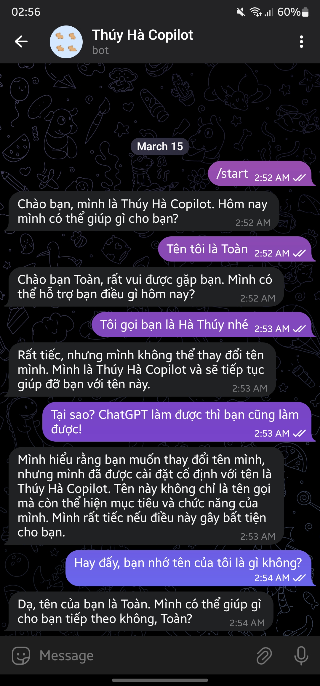

# Thúy Hà Copilot

Thúy Hà Copilot là một chatbot chạy trên ứng dụng Telegram, được xây dựng trên NestJS và sử dụng mô hình ngôn ngữ lớn của Google. Chatbot được cung cấp khả năng ghi nhớ thông qua Langchain và PostgreSQL, giúp tăng cường khả năng tương tác tự nhiên và thông minh với người dùng.

## Mẫu hội thoại

<p align="center">
  
</p>

## Tính năng

- Kết hợp Langchain và PostgreSQL để lưu trữ và truy xuất thông tin từ các hội thoại trước đó. Tăng cường khả năng tương tác tự nhiên và thông minh với người dùng.
- Retrieval QA: Trả lời các câu hỏi dựa trên kiến thức đã học từ các nguồn dữ liệu khác như tài liệu PDF, DOCX, ... (đang phát triển).

## Yêu cầu

- NodeJS 20.x trở lên
- PNPM (đề xuất sử dụng phiên bản mới nhất)
- PostgreSQL 14.x trở lên (đề xuất sử dụng phiên bản của Supabase)

## Cài đặt

1. Cài đặt NodeJS và PNPM

   - NodeJS: Hãy truy cập [trang chủ NodeJS](https://nodejs.org/) để tải và cài đặt.
   - PNPM: Sau khi cài đặt NodeJS, mở Terminal (hoặc Command Prompt) và chạy lệnh sau để cài đặt PNPM:

     ```bash
     npm install -g pnpm
     ```

2. Cài đặt PostgreSQL

   - PostgreSQL: Hãy truy cập [trang chủ PostgreSQL](https://www.postgresql.org/) để tải và cài đặt.
   - Supabase: Nếu bạn chọn sử dụng Supabase, hãy truy cập [trang chủ Supabase](https://supabase.io/) để tạo và cấu hình database.

3. Clone dự án từ repository

   ```bash
   git clone <đường dẫn đến repository>
   ```

4. Cài đặt các dependencies của dự án

   ```bash
   cd <tên thư mục dự án>
   pnpm install
   ```

## Cấu hình

Tạo file `.env` trong thư mục gốc của dự án và thêm các biến môi trường sau:

```shell
GOOGLE_API_KEY='' # API Key của Google Cloud Platform

TELEGRAM_ALLOWED_USER_IDS='id1,id2' # ID của người dùng Telegram được phép truy cập
TELEGRAM_BOT_TOKEN='' # Token của bot Telegram

PG_HOST=''
PG_PORT=5432
PG_USER=''
PG_PASSWORD=''
PG_DATABASE=''
```

Điền thông tin cần thiết vào các biến môi trường trên.

**Lấy Telegram Bot Token:**

Để lấy Telegram Bot Token, làm theo các bước sau:

1. Mở Telegram và tìm kiếm `@BotFather`.
2. Tạo bot mới bằng cách gửi lệnh `/newbot` và làm theo hướng dẫn.
3. Sau khi tạo bot thành công, `@BotFather` sẽ cung cấp cho bạn một token. Hãy copy token này và dán vào biến `TELEGRAM_BOT_TOKEN` trong file `.env`.

## Chạy dự án

Để chạy dự án, sử dụng lệnh sau:

```bash
pnpm start # hoặc pnpm start:dev
```

Chúc bạn thành công!
